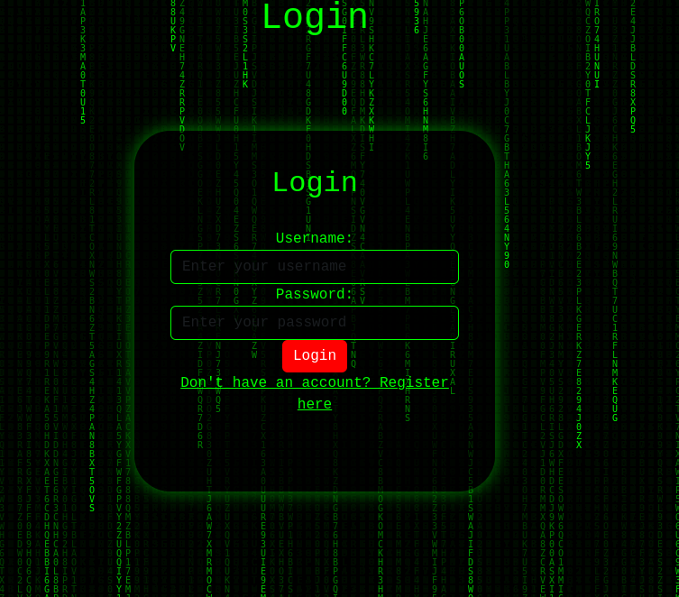
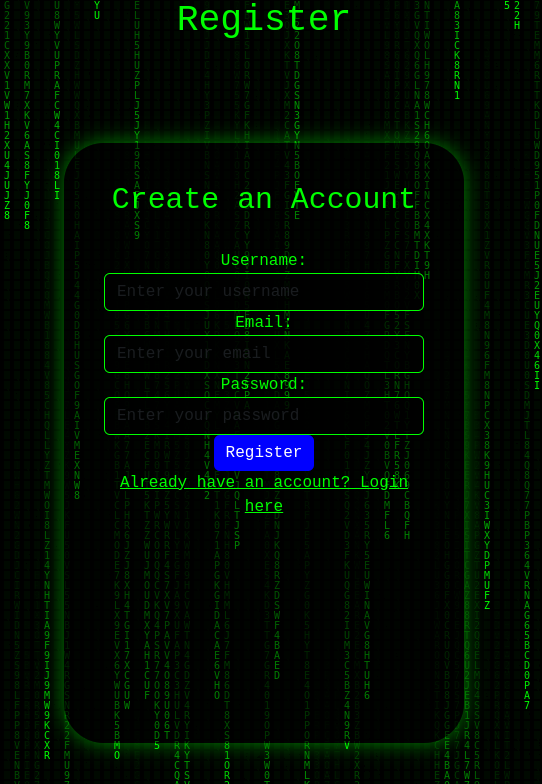

# Responsive User Registration

  
  

## Overview

Responsive User Registration is a Spring Boot web application that provides a user-friendly interface for user registration and login functionalities. The application incorporates modern design principles and features a responsive layout, ensuring compatibility across various devices.

### Features

- User registration with validation
- Login and logout functionalities
- Password encryption using BCrypt
- Responsive design using Bootstrap
- Toast notifications for error messages
- Infinite scrolling for seamless user experience

## Technologies Used

- **Backend**: Spring Boot, Spring Security, Jakarta EE
- **Frontend**: HTML, CSS, JavaScript, Bootstrap
- **Database**: H2 Database (or any other preferred database)
- **Build Tool**: Maven

## Getting Started

### Prerequisites

- Java 17 or later
- Maven
- IDE (e.g., IntelliJ IDEA, Eclipse)

### Installation

1. Clone the repository:
   \`\`\`bash
   git clone https://github.com/w0140158/responsive-user-registration.git
   \`\`\`
2. Navigate to the project directory:
   \`\`\`bash
   cd responsive-user-registration
   \`\`\`
3. Build the project using Maven:
   \`\`\`bash
   mvn clean install
   \`\`\`
4. Run the application:
   \`\`\`bash
   mvn spring-boot:run
   \`\`\`
5. Open your browser and navigate to `http://localhost:8080/login` to access the application.

## API Endpoints

Here are the key API endpoints available in the application:

- **POST /api/auth/register**  
  Registers a new user. Expects a JSON object with `username`, `password`, and `email`.
  
- **POST /login**  
  Authenticates the user with `username` and `password`.

- **GET /index**  
  Retrieves the main dashboard for authenticated users.

- **GET /login?error=true**  
  Redirects to the login page with an error message when authentication fails.

- **GET /logout**  
  Logs the user out and invalidates the session.

- **GET /register**  
  Returns the registration page for new users.

## Usage

1. **Register**: Navigate to the registration page to create a new account.
2. **Login**: Use your credentials to log in.
3. **Logout**: Click the logout button to end your session.

## Configuration

- Update the application properties in `src/main/resources/application.properties` to configure database settings or other environment variables.

## Contribution

Contributions are welcome! Please create a pull request or open an issue for any suggestions or improvements.

## License

This project is licensed under the MIT License - see the [LICENSE](LICENSE) file for details.

## Contact

For questions or inquiries, please reach out to [your email address or contact method].
